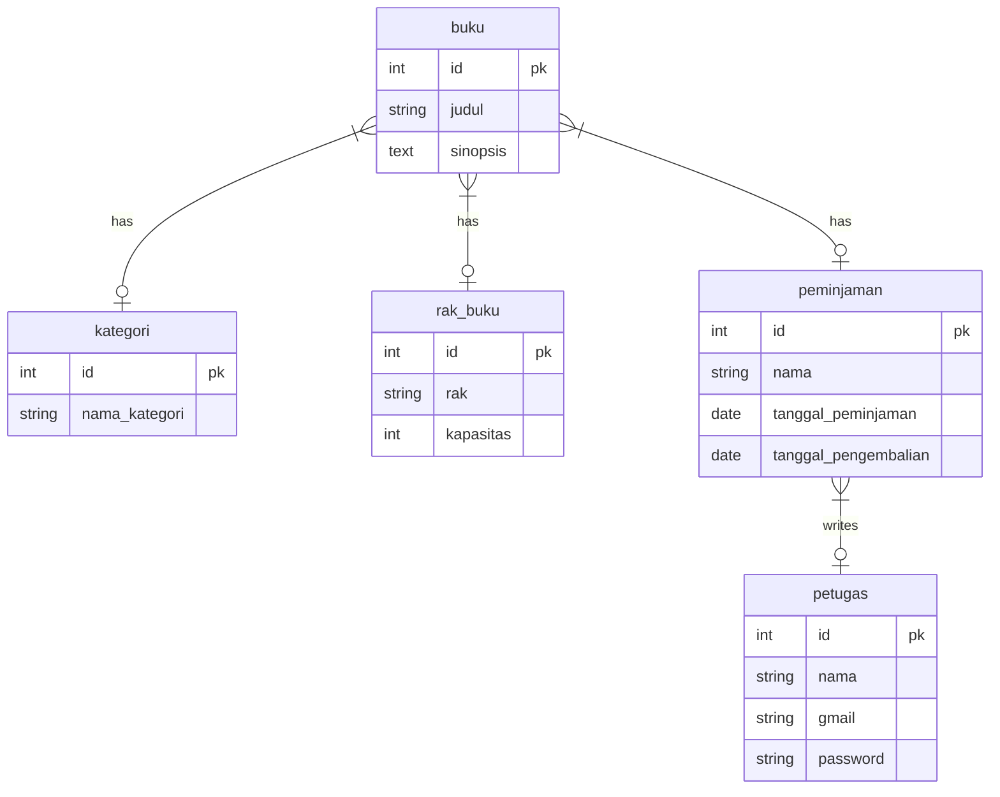

# ERD Perpustakaan

```mermaid
erDiagram
buku {
    int id pk
    string judul
    text sinopsis
}

kategori {
    int id pk
    string nama_kategori
}

rak_buku {
    int id pk
    string rak
    int kapasitas
}

petugas {
    int id pk
    string nama
    string gmail
    string password
}

peminjaman {
    int id pk
    string nama
    date tanggal_peminjaman
    date tanggal_pengembalian
}

buku }|--o| kategori : has
buku }|--o| rak_buku : has
buku }|--o| peminjaman : has
peminjaman }|--o| petugas : writes
```
